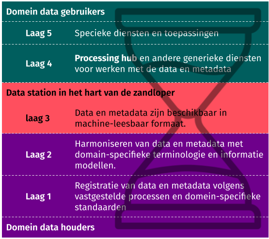

# Architectuur kaders

## PLUGIN als referentieimplementatie van de datastation specificatie

De PLUGIN architectuur neemt de [datastation specifcatie (v1.0)](https://health-ri.github.io/data-station-specification/) als uitgangspunt. Deze specificatie is in opdracht van Health-RI opgesteld om invulling te geven aan een landelijk dekkend netwerk voor secundair gebruik van zorggevens. PLUGIN/DHD en Health-RI hebben daarbij de intentie uitgesproken dat de PLUGIN infrastructuur een referentieimplementie is van deze specficitatie. In het onderstaande gaan we kort in op de belangrijkste uitgangspunten van de datastation specificatie. Voor meer details verwijzen we naar de specifiatie zelf.

## Uitgangspunten nationale gezondheidsinformatiestelsel

Het verlenen van zorg vindt vaak plaats in een netwerk van zorgaanbieders uit verschillende sectoren. Digitalisering, gegevensuitwisseling en databeschikbaarheid vervullen hierin een cruciale rol. Om dit mogelijk te maken, wordt in Nederland gewerkt aan de realisatie van een Landelijk Dekkend Netwerk (LDN). Het LDN is een overkoepelende term en omvat:

- een LDN van **infrastructuren**, dat zorgaanbieders met elkaar verbindt voor het uitwisselen en beschikbaar stellen van gezondheidsgegevens;
- een bijbehorend **vertrouwensstelsel** met technische, organisatorische en juridische afspraken die nodig zijn om te zorgen dat burgers en zorgverleners kunnen vertrouwen op de data en op het veilige en verantwoorde gebruik ervan;
- **generieke functies** met afspraken, standaarden en voorzieningen zoals voor identificatie, authenticatie en autorisatie en adressering.

De datastation specificatie met PLUGIN als referentieimplementatie heeft als doel om een LDN voor secundair gebruik te realiseren. De uitgangspunten zoals zijn geformuleerd in de nationale visie en strategie voor het gezondheidsinformatiestelsel (NVS) zijn hierin leidend, te weten[^1]:

- **Privacy en security by design:** privacy en gegevensbeveiliging worden al bij de ontwikkeling van functionaliteit voor het landelijk dekkend netwerk meegenomen in het ontwerp.
- Een hoge mate van **opensourcewerken:** door in openbaarheid vrij toegankelijke software en code te ontwikkelen, wordt het risico op leveranciersafhankelijkheid zoveel mogelijk voorkomen.
- De mogelijkheid tot **schaalbaarheid** zodat functionaliteit later opgeschaald kan worden naar landelijk gebruik.
- De mogelijkheid van **inbeheername door een publieke organisatie**, zodat beschikbaarheid van data geen verdienmodel wordt.
- De **brede toepasbaarheid** van het landelijk dekkend netwerk over het gehele zorg- en welzijnsdomein en ook voor secundair gebruik.
- **Data worden zoveel mogelijk opgeslagen bij de bron.** Altijd onder verantwoordelijkheid en invloedssfeer van de bronhouder.

[^1]: Zie de website [datavoorgezondheid.nl](https://www.datavoorgezondheid.nl/onderwerpen/l/landelijk-dekkend-netwerk) van VWS voor meer details.

## Een hybride, decentrale architectuur waarin datahouders en datagebruikers centraal staan

Alhoewel Nederlandse en Europese richtlijnen uitgaan van een decentrale benadering met _privacy by design_, constateren we een lancune in het tot uitvoer brengen van dit principe. In de inleiding van de EHDS wordt in [overweging 80](https://eur-lex.europa.eu/legal-content/NL/TXT/HTML/?uri=OJ:L_202500327#rct_80) gesteld dat:

> Gezien de gevoeligheid van gezondheidsgegevens moeten waar mogelijk beginselen als “privacy door ontwerp” en “privacy door standaardinstellingen” en het concept “breng de vragen naar de gegevens in plaats van die gegevens te verplaatsen” in acht worden genomen.

Het concept van _data visiting_, ook wel bekend als _federated computing_, _algorithm-to-the-data_ of _Personal Health Train (PHT)_, wordt nergens in de EHDS nader toegelicht[^2].

Om invulling te geven aan deze principes, gaat PLUGIN uit van een hybride, decentrale architectuur waarin datahouders en datagebruikers centraal staan. Aan de kant van de datahouders is het datastation het essentiele systeem waarmee datahouders op een effectieve en effiente manier data beschikbaar kunnen stellen voor hergebruik. Aan de kant van de datagebruikers is de processing hub de centrale component voor het realiseren van een beveiligde verwerkingsomgeving waarin datagebruikers kunnen werken. De combinatie van een datastation en de processing hub vormt de essentie van de voorgestelde architectuur.

[^2]: Het woord _federated_ komt slecht twee keer voor in de EHDS verordening.

## Het zandlopermodel als leidraad voor interoperabiliteit

Het concept van **datastations** een van de twee pijlers is van de PLUGIN architectuur. Dit concept kent echter verschillende verschijningsvormen:

1. Het originele concept van PHT omschrijft datastations in de context van _federated learning_ [@choudhury2025advancing], wat vervolgens is gegeneraliseerd om andere vormen van gefedereerde berekeningen te omvatten [@boninodasilvasantos2022personal].
2. Het [Programma KIK-V](https://www.kik-v.nl/starten-met-kik-v) van het Zorginstituut heeft het concept van datastations geoperationaliseerd voor geautomatiseerde informatie-uitwisseling voor de VVT-sector, wat een vorm is van _federated analytics_.
3. De Europese blauwdrukken voor _Trusted Research Environments_ (TREs) gaan uit van een concept van _Secure Data Zones_ waarbij een federatie van TREs via _federated data transfer_ data kunnen uitwisselen.[^3]
4. De FAIR principes zijn uitgewerkt in het concept van een [FAIR data point](https://specs.fairdatapoint.org/fdp-specs-v1.2.html), zijnde een datastation gevuld met FAIR metadata van de data dat is bedoeld als een gefedereerde oplossing voor een data catalogus.

Alhoewel PLUGIN haar oorsprong vindt in het realiseren van een _federated learning_ infrastructuur (punt 1), zijn alle vier bovenstaande concepten geintegreerd tot één hybride, open architectuur. Daarbij is het zandloper model als metafoor gebruikt om interoperabiliteit te realiseren in de verschillende lagen.[^4] @schultes2023fair heeft de principes van het zandloper model gecombineerd met de FAIR principes om tot een vijflagenmodel te komen, waarin de data stromen vanaf het eerste moment dat ze worden vastgelegd door de data houder (laag 1) tot en met het uiteindelijke secundair gebruik door de datagebruiker (laag 5).

In **laag 1** wordt de data gecreëerd. Diegene die verantwoordelijk is voor het vastleggen van de data heeft hierin maximale vrijheid. Voor PLUGIN gaan we uit van routinematig vastgelegde zorgdata die als onderdeel van het primaire proces worden vastgelegd in electronische patientendossiers (EPDs), _Picture Archiving and Communications Systems_ (PACS) of labsystemen.

In **laag 2** wordt een begin gemaakt met het standaardiseren van de data. Het is een soort trechter waar met gebruik van allerlei databewerkings tools de data en metadata van de data worden omgezet naar gestructureerde formats die machine-leesbaar zijn en gebruik maken van gestandaardiseerde terminologie en informatieschemas.

**Laag 3 is het hart van de zandloper** en fungeert als een brug tussen de twee onderste en twee bovenste lagen. In deze laag worden de data en metadata (1) klaargezet voor gebruik en FAIRificatie proces en (2) verbonden aan het netwerk van beveiligde verwerkingsomgevingen. Deze laag is het meest cruciale om interoperabiliteit te realiseren. Daarvoor wordt een set van minimale, open en technologie-neutrale standaarden gedefinieerd. Het feit dat de data beschikbaar is gemaakt wil overigens niet zeggen dat het 'zomaar' wordt vrijgegeven. Voor elke datagebruiker zal speficiek worden bepaalt welke subset van data beschikbaar wordt gesteld.

In **laag 4** is de de processing hub gepositioneerd, weermee elk datastation opgenomen kan worden in een netwerk om de data te verwerken en te verbruiken. Daarnaast zitten in deze laag de generieke voorzieningen zoals een catalogus en zoekfunctionaliteit.

In **laag 5** wordt aan de datagebruiker maximale vrijheid gegeven om allerlei diensten af te nemen en/of analyses te doen.

:::{.callout-note}

## Datastations voor primair vs. secundair gebruik

De PLUGIN architectuur is bedoeld als een oplossing voor een landelijk dekkende infrastructuur voor secundair gebruik. Een PLUGIN datastation is op een aantal punten wezenlijk anders dan een datastation voor primair gebruik. Datastations in de context van primair gebruik zijn conceptueel hetzelfde als de [Shared Health Record](https://guides.ohie.org/arch-spec/openhie-component-specifications-1/openhie-shared-health-record-shr) component zoals gespecificeerd in de [OpenHIE architectuur](https://guides.ohie.org/arch-spec). RSO Zuid-Limburg werkt aan een primair datastation op basis van openEHR, een oplossingsrichting die ook in Scandinavië [@pohjonen2022norway] en Slovenië [@bajric2023building] wordt gebruikt. Hoewel datastations voor primair gebruik veel overeenkomsten vertonen met datastations voor secundair gebruik, zijn er ook belangrijke verschillen in de technische kenmerken tussen deze systemen. Deze verschillen zitten bijvoorbeeld in snelheid (_latency_) en volume waarmee data in het station kan worden benaderd: voor primair gebruik moeten snel enkelvoudige records kunnen worden opgehaald, terwijl voor secundair gebruik grotere datasets bevraagd kunnen worden en hogere wachttijden acceptabel zijn. 
:::

[^3]: Zie [EOSC-ENTRUST Blueprint & Interoperability Framework](https://zenodo.org/records/18299343) en [DARE UK Federated Architecture Blueprint](https://zenodo.org/records/14192786) voor meer details.
[^4]: Het succes van het internet en andere technologieën met een sterk netwerkeffect, zoals het Linux/Unix operating systeem, heeft ons geleerd dat standaardisatie een groot goed is, maar dat we spaarzaam moeten zijn in het opleggen van standaarden. Dit concept is beschreven met een zandloper als metafoor [@estrin2010health;@beck2019hourglass].

