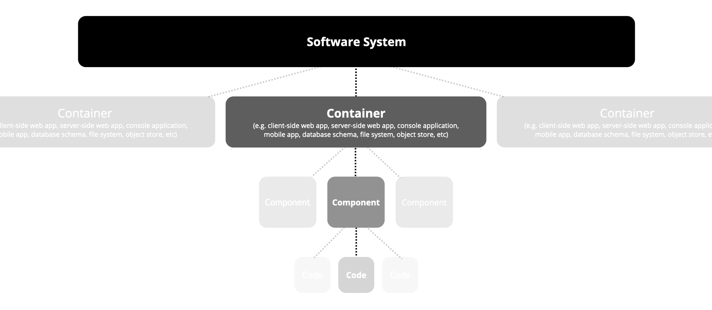
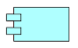

# Bouwstenen View {#sec-building-block-view}

::: {.callout-caution collapse="true"}

## Gebruikte modelleringsconventies

In @sec-building-block-view, @sec-runtime-view en @sec-deployment-view gebruiken we het [C4 model](https://c4model.com/) om de sofware architectuur te visualiseren . C4 kent vier abstractieniveaus zoals hieronder is weergegeven. In dit document beschrijven we de architectuur tot en met component niveau.



**Let op:** wat in C4 een container heet, is vergelijkbaar met het concept van een Applicatie component in Archimate. Beiden zijn abstracties die als op zichzelf staande applicaties te implementeren zijn. Een C4 container is gevisualiseerd onderstaand icoon. Wat in C4 een component heet is **niet** afzonderlijk deploybaar.



:::

::: {.callout-caution collapse="true"}
## Detailniveau van dit architectuur document

Dit architectuur document richt zich vooral op het datastation en de processing hub als belangrijke deelsystemen. Het voert te ver om de details van een volledige data space te beschrijven, inclusief generieke componenten voor identificatie, authenticatie, authorisatie en bijvoorbeeld de landelijke catalogus functie. Waar relevant zullen we wel ingegaan op het koppelvlak met deze systemen.

:::

## Gehele whitebox systeem

```{=html}
<likec4-view
   view-id="__plugin"
   browser="true"
   dynamic-variant="sequence">
</likec4-view>
```

Op het hoogste abstractieniveau heeft PLUGIN dezelfde architectuur als een data space. De Processing Hub en het Datastation de belangrijkste deelsystemen die zijn ontworpen voor gebruik door de datagebruiker resp. de datahouder. In lijn met de vereisten voor technische interoperabiliteit (TIR, met name TIR-1) gaan we uit van web-gebaseerde user interfaces, APIs en Python client libraries als interfaces.

:::{.list-table tbl-colwidths="[15,50,35]"}

- - Component
  - Rol en verantwoordelijkheid
  - Interfaces

- - **Datastation**
  - Beveiligde omgeving waarin datasets en gegevensdiensten van een datahouders worden ontsloten volgens afgesproken standaarden, met expliciete regels voor toegang, autorisatie, logging en gebruik.
  - - web-gebaseerde UI voor gebruikers en beheerders
    - REST API
    - Python client libraries

- - **Processing Hub**
  - Een federatieve data processing systeem dat voldoet aan de eisen van beveiligde verwerkingsomgeving (BVO)
  - - web-gebaseerde UI voor gebruikers en beheerders
    - REST API
    - Python client libraries

:::


## Niveau 2: Datastation {#_datastation}

```{=html}
<likec4-view
   view-id="datastation"
   browser="true"
   dynamic-variant="sequence">
</likec4-view>
```

Het datastation is de hoeksteen van de PLUGIN architectuur. Het datastation zien wij als het koppelvlak waarmee de datahouder haar data beschikbaar stelt aan derden[^1]. Het datastation is zo ontworpen dat het een generieke oplossing is voor het beheren van de data en het decentraal uitvoeren van berekeningen via _data visiting_. Het datastation zorgt ervoor dat alle data beschermd zijn en is defensief ontworpen ten aanzien van cybersecurity. Daarnaast worden alle berekeningen die op het datastation worden uitgevoerd transparant gelogt en gemonitord om daarmee te voldoen aan de eisen van wet- en regelgeving. Datahouders zijn te allen tijde verantwoordelijk voor het datastation en bepalen wie wanneer toegang krijgt tot het datastation.

::: {.callout-note}

## Data die op het datastation beschikbaar is, ligt niet 'zomaar op straat'

Wanneer een datahouder gezondheidsgegevens beschikbaar heeft gesteld op het datastation wil dat niet zeggen dat het daarmee meteen toegankelijk is voor iedereen. Zoals in @sec-requirementsoverzicht is geschetst, wordt er een onderscheid gemaakt in _data preparation_ (beschikbaar maken) en _use of data_ (gebruik van data). Het is de bedoeling dat elk verzoek voor gebruik van data via een vergunning of een gegevensverzoek afzonderlijk wordt beoordeeld, zoals in de EHDS is voorgeschreven. Het datastation richt zich met name op het gestandaardiseerd beschikbaar maken van data zodat datahouders zich effectief en efficient kunnen voorbereiden op (toekomstig) secundair gebruik van data.
:::

:::{.list-table tbl-colwidths="[15,50,35]"}

- - Niveau 3
  - Verantwoordelijkheid
  - Interfaces

- - **PLUGIN-Lake**
  - Lakehouse voor het opslaan en beheren van grote hoeveelheden gestructureerde en ongestructureerde data, inclusief metadata en _data lineage_.
  - - web-gebaseerde UI voor gebruikers en beheerders
    - REST API
    - Python client libraries

- - **Dagster**
  - 'Commandocentrum' voor orchestratie van datapipelines, inclusief logging en monitoring.
  - - web-gebaseerde UI voor gebruikers en beheerders
    - API en extensie mechanisme
    - Python client libraries

- - **PLUGIN-Rosetta**
  - Integreert en maakt bestaande (internationale) informatiemodellen en mappings als beschikbaar voor gebruik.
  - - web-gebaseerde UI voor gebruikers bekijken van de modellen
    - Python module

- - **Processing Hub client**
  - Client-side applicatie van de Processing Hub, waarmee datastation kan participeren een federatief processing netwerk. Nu vantage6 node en algoritme register, op termijn ook andere componenten
  - - API
    - CLI

:::

::: {.panel-tabset}

### PLUGIN-Lake

```{=html}
<likec4-view
   view-id="__plugin_datastation_plugin-lake"
   browser="true"
   dynamic-variant="sequence">
</likec4-view>
```
- PLUGIN-Lake is implementatie van lakehouse architectuur, maar dan geoptimaliseerd voor decentraal systeem
- Principe dat alle interacties naar de storage laag via een interface lopen
   - Dagster deamon als _gatekeeper_ incl. loging zoals vereist in TIR-12, TIR-13, FSPER-4
   - PLUGIN-Lake API implementeert REST API zoals vereist in vereisten voor technische interoperabiliteit, met name TIR-1 t/m TIR-5.

### PLUGIN-Rosetta

```{=html}
<likec4-view
   view-id="__plugin_datastation_plugin-rosetta"
   browser="true"
   dynamic-variant="sequence">
</likec4-view>
```

### vantage6 node

```{=html}
<likec4-view
   view-id="__plugin_datastation_vantage6-node"
   browser="true"
   dynamic-variant="sequence">
</likec4-view>
```

### Nuts-node

[NUTS](devries@dhd.nl) is een landelijk project dat een [specificatie](https://nuts-foundation.gitbook.io/) heeft geschreven voor het realiseren van identificatie, autorisatie, register en logging voor decentrale netwerken. De [Nuts-node](https://nuts-node.readthedocs.io/) is een open-source software referentie-implementatie van de Nuts-specificatie die in PLUGIN is geintegreerd.

Dit deel van de architectuur is nog in ontwikkeling.

### Dagster

Dagster is compleet data orchestratie systeem, in feite het commandocentrum die ervoor dat data veilig en efficiënt verwerkt kan worden. Het bestaat uit vier onderdelen:

- ***Software-Defined Assets:*** dataproducten zijn het hart van Dagster. In plaats van te focussen op de "stapjes" (eerst dit doen, dan dat), kijkt Dagster naar het eindresultaat. Bijvoorbeeld: "Ik wil een tabel met de verkoopcijfers van vandaag." Dagster begrijpt vervolgens zelf welke stappen nodig zijn om die tabel te maken.

- ***Jobs & Ops:***: de feitelijke taken en het werk wat moet worden uitgevoerd. Een _Op_ is een klein taakje (bijv. "reken de BTW uit") en een _Job_ is een verzameling van die taakjes die samen iets bereiken.

- ***Sensors & Schedules:*** de werkplanning. Een _Schedule_ start elke ochtend om 08:00 uur, terwijl een Sensor pas afgaat als er bijvoorbeeld een nieuw bestand in een mapje verschijnt.

- ***Dagster UI:*** het dashboard waarmee je een visueel overzicht hebt en kunt zien hoe je data-fabriek draait. Als er iets fout gaat, zie je hier direct waar de fout zit en waarom.

We hebben gekozen voor Dagster omdat het een van de meest volwassen open source systemen is voor data orchestratie. Het _Asset-First_ principe maakt het mogelijk om het overzicht te bewaren. Daarnaast is Dagster zo ontworpen dat zowel ontwikkelaars als de data-analisten in hetzelfde systeem kunnen kijken. Het heeft een uitgebreid ecosysteem en een extensie mechanisme waarmee we het binnen PLUGIN makkelijk kunnen integreren met de andere componenten.

De verschillende componenten van Dagster zijn opgenomen in de verschillende sub-systemen van PLUGIN en worden daar beschreven.

:::

## Niveau 2: Processing hub {#_processing_hub}

```{=html}
<likec4-view
   view-id="ph"
   browser="true"
   dynamic-variant="sequence">
</likec4-view>
```
:::{.list-table tbl-colwidths="[15,50,35]"}

- - Niveau 3
  - Verantwoordelijkheid
  - Interfaces

- - **PLUGIN-ML**
  - Component dat [flower.ai](https://flower.ai) integreert met vantage6 om federated learning toegankelijk te maken voor ontwikkelaars.
  - - web-gebaseerde UI (vantage6 UI)
    - Python client library

- - **PLUGIN-Hub**
  - Component voor het federatief delen (_data pooling_) van data.
  - - web-gebaseerde UI (vantage6 UI)
    - Python client library

- - **PLUGIN-Analytics**
  - Analyse tools en visualisaties om te werken met geaggreerde resultaten van federatieve berekeningen.
  - - web-gebaseerde UI
    - Python module

- - **Processing Hub server**
  - Server-side applicatie van de Processing Hub, waarmee netwerk van datastations worden aangestuurd en beheerd. Nu vantage6 server, op termijn ook andere componenten
  - - web-gebaseerde UI (vantange6 UI)
    - API

:::

::: {.panel-tabset}

### PLUGIN-ML

```{=html}
<likec4-view
   view-id="__plugin_ph_plugin-ml"
   browser="true"
   dynamic-variant="sequence">
</likec4-view>
```

### PLUGIN-Hub

```{=html}
<likec4-view
   view-id="__plugin_ph_plugin-hub"
   browser="true"
   dynamic-variant="sequence">
</likec4-view>
```

### PLUGIN-Analytics

```{=html}
<likec4-view
   view-id="__plugin_ph_some-server"
   browser="true"
   dynamic-variant="sequence">
</likec4-view>
```
Dit deel van de architectuur is nog in ontwikkeling.

:::

[^1]: In analogie met de telecommunicatie industrie kan je het datastation zien als het [ISRA-punt](https://nl.wikipedia.org/wiki/ISRA). Het is het scheidingspunt tussen 'de binnenkant' van de datahouder (analogie: de randapparatuur in het huis) en 'de buitenkant' (analogie: het telecomnetwerk).
